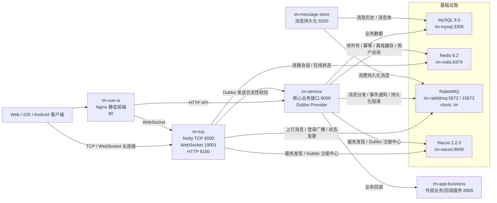
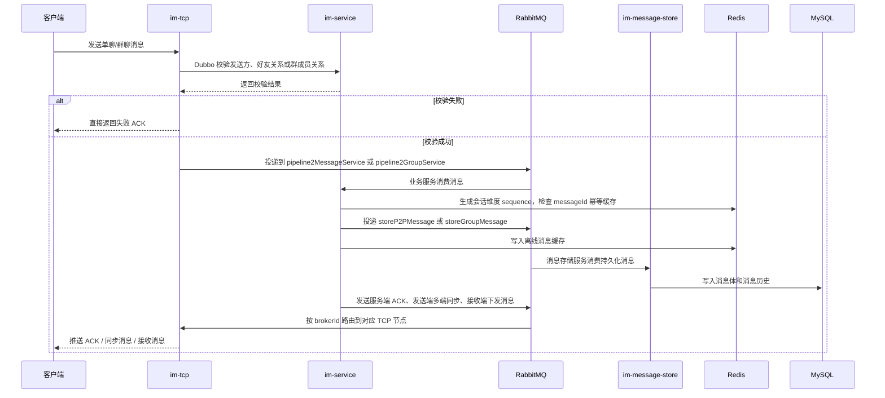
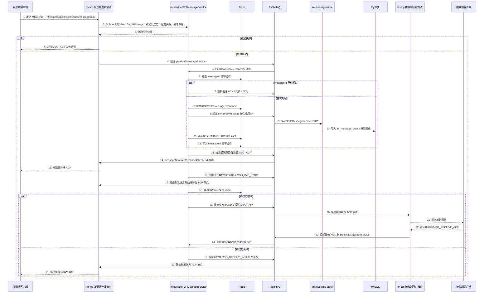
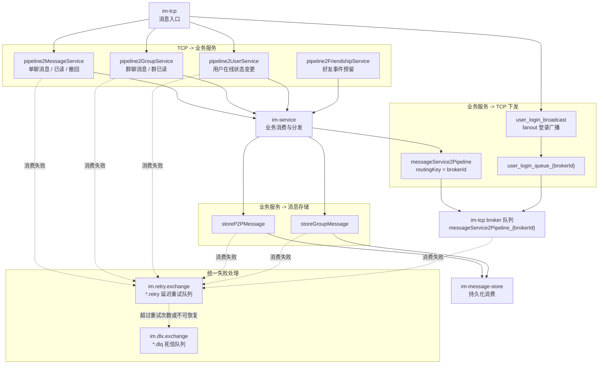

<!--TRANSLATION_LINKS_START-->
#### Supported by [GitHub Doc Translation](https://github.com/scenery-j/GitHub-Doc-Translation)
<!--TRANSLATION_LINKS_END-->

# IM-SERVICE 分布式即时通讯系统

基于 Spring Boot、Netty、Dubbo、RabbitMQ、Redis、MySQL、Nacos 的分布式即时通讯系统，支持 TCP/WebSocket 长连接、单聊、群聊、多端同步、离线消息、在线状态、消息 ACK、消息幂等、消息顺序控制和异步持久化。

## 1. 架构设计概览

当前项目按“长连接网关层、核心业务层、异步存储层、基础设施层”拆分职责：

1. **长连接网关层**：`im-tcp` 负责 TCP/WebSocket 连接生命周期管理，包括登录、心跳、断线下线、本地 Channel 缓存、Redis session 写入、消息上行投递和消息下行推送。涉及复杂业务规则时，通过 Dubbo 调用 `im-service`。
2. **核心业务层**：`im-service` 负责用户、好友、群组、会话和消息业务。消息上行后，业务层完成发送合法性校验、Redis sequence 生成、消息幂等判断、发送端 ACK、多端同步、接收端路由和在线状态通知。
3. **异步存储层**：`im-message-store` 独立消费消息持久化队列，将消息体和消息历史写入 MySQL，避免消息发送主链路被数据库写入耗时阻塞。
4. **消息中间件层**：RabbitMQ 承担 TCP 到业务服务、业务服务到 TCP、业务服务到存储服务之间的异步解耦；当前消费端使用手动 ACK，失败消息先进入 retry 队列，超过重试次数或不可恢复异常后进入 DLQ。
5. **缓存与状态层**：Redis 用于保存用户在线 session、离线消息 zset、消息幂等 key、会话/好友/群组 sequence、用户在线状态和订阅关系。
6. **服务发现层**：Nacos 负责 TCP/WebSocket 服务实例注册发现，同时作为 Dubbo 注册中心。用户登录接口根据客户端类型返回可连接的 TCP 或 WebSocket 节点地址。
7. **数据持久层**：MySQL 保存用户资料、好友关系、群组数据、会话数据、消息体和消息历史。

这种拆分使长连接层可以横向扩展，业务处理和消息存储可以独立扩容，消息发送链路也能通过 MQ 做削峰和失败隔离。

## 2. 项目模块说明

根目录是 Maven 多模块工程，核心 Java 模块由根 `pom.xml` 管理。

| 模块 | 类型 | 主要职责 | 默认端口 / 说明 |
| --- | --- | --- | --- |
| `im-common` | 公共基础模块 | 定义公共常量、枚举、异常模型、响应模型、用户会话模型、消息模型、Dubbo 接口、路由算法和通用工具类。 | 被其他后端模块依赖，不单独启动。 |
| `im-codec` | 协议编解码模块 | 定义自定义 IM 私有协议、消息头、消息包、TCP 编解码器、WebSocket 编解码器以及各类业务 Pack DTO。 | 被 `im-tcp` 和业务模块复用，不单独启动。 |
| `im-service` | 核心业务服务 | 提供用户、好友、好友申请、群组、群成员、会话、消息发送、离线消息同步、历史消息查询等 HTTP 接口；通过 Dubbo 暴露消息发送合法性校验能力；消费 TCP 上行 MQ 并完成业务分发。 | HTTP `8000`，启动类 `com.jiangjing.ServiceApplication`。 |
| `im-message-store` | 消息持久化服务 | 消费 `storeP2PMessage`、`storeGroupMessage` 队列，将单聊/群聊消息体和消息历史写入 MySQL；对重复消息做幂等确认，对异常消息进入 retry/DLQ 流程。 | HTTP `8200`，启动类 `com.jiangjing.im.ImMessageStoreApplication`。 |
| `im-tcp` | 长连接网关服务 | 启动 Netty TCP 和 WebSocket 服务；负责客户端连接、登录、心跳、协议解析、连接本地缓存、Redis 用户 session 写入、消息上行投递、消息下行推送和多端互斥登录通知。 | HTTP `8100`，TCP `9000`，WebSocket `19001`，启动类 `com.example.imtcp.ImTcpApplication`。 |
| `im-mysql-init` | 初始化脚本 | Docker 启动 MySQL 时执行初始化 SQL，创建业务表和初始化演示数据。 | 由 Compose 挂载到 MySQL 容器。 |
| `im-rabbitmq` | RabbitMQ 镜像配置 | 构建自定义 RabbitMQ 镜像，初始化 `root/root` 用户和 `im` virtual host。 | RabbitMQ `5672`，管理端 `15672`。 |
| `im-vue-ui` | 前端静态资源 | 已构建好的前端页面和 Nginx 配置，负责 Web 端页面访问。 | HTTP `80`。 |
| `im-app-business` | 外部业务服务目录 | Compose 中引用的外部业务服务镜像目录，主要用于业务系统接入和回调演示；当前不在根 Maven modules 中。 | HTTP `8300`。 |

## 3. 技术栈

- Java 8
- Spring Boot 2.3.x
- Netty
- Apache Dubbo
- RabbitMQ
- Redis
- MySQL
- MyBatis-Plus
- Nacos
- Docker / Docker Compose

## 4. 部署架构



## 5. 核心链路

### 5.1 核心消息流转



### 5.2 单聊消息端到端链路



### 5.3 RabbitMQ 通道拓扑



## 6. 关键设计点

### 6.1 消息即时性

- 将发送合法性校验前置到 `im-tcp`，通过 Dubbo 调用 `im-service`，非法消息不进入 MQ。
- 消息入库通过 MQ 异步化，避免数据库写入阻塞消息下发。
- 接收端在线时，业务服务根据 Redis 中的 session 路由到对应 TCP 节点下发。

### 6.2 消息有序性

- 单聊按会话维度使用 Redis 自增 sequence。
- 群聊按群维度使用 Redis 自增 sequence。
- 客户端可根据 sequence 进行展示排序和增量同步。

### 6.3 消息可靠性

- 服务端处理成功后给发送端返回服务端 ACK。
- 接收端收到消息后返回接收 ACK。
- 接收方离线时，服务端代发接收 ACK，并保留离线消息。
- RabbitMQ 消费使用手动 ACK，失败消息进入 retry/DLQ。

### 6.4 消息幂等性

- 客户端生成 `messageId`。
- 服务端使用 Redis 缓存已处理的 `messageId`。
- 重复消息不重复入库，只重新触发 ACK、同步和下发。

## 7. 功能演示

### 7.1 登录页面


### 7.2 聊天首页


### 7.3 智能问答


### 7.4 添加好友


### 7.5 好友详情


### 7.6 单聊展示


### 7.7 群聊展示


### 7.8 登出页面


## 8. 环境要求

- JDK 8+
- Maven 3.6+
- Docker 20.10+
- Docker Compose 2.0+

## 9. 构建与启动

### 9.1 Maven 构建

```bash
# 编译所有 Maven 模块
mvn clean compile

# 打包所有 Maven 模块，跳过测试
mvn clean package -DskipTests

# 运行所有测试
mvn test

# 只测试某个模块及其依赖
mvn -pl im-service -am test
```

### 9.2 Docker Compose 启动

启动前需要准备构建产物：

```bash
# 打包 Maven 多模块服务（不包含 im-app-business）
mvn clean package -DskipTests

# im-app-business 不在当前 Maven modules 中，默认 Compose 启动前需要已有该 jar
test -f im-app-business/target/im-app-business-1.0.0-SNAPSHOT.jar

# im-vue-ui 当前使用已构建的静态产物
test -d im-vue-ui/dist
```

构建和启动：

```bash
# 构建所有镜像
docker compose build

# 启动所有服务
docker compose up -d

# 查看服务状态
docker compose ps

# 查看指定服务日志
docker compose logs -f im-service

# 停止并删除容器和网络；带 -v 会删除数据卷
docker compose down -v
```

如果环境只安装了旧版 Compose，可将命令中的 `docker compose` 替换为 `docker-compose`。

### 9.3 推荐启动顺序

1. MySQL、Redis、RabbitMQ、Nacos
2. `im-service`
3. `im-message-store`
4. `im-app-business`
5. `im-tcp`
6. `im-vue-ui`

## 10. 服务访问

| 服务 | 地址 |
| --- | --- |
| Nacos 控制台 | http://localhost:8848/nacos |
| RabbitMQ 管理界面 | http://localhost:15672 |
| `im-service` | http://localhost:8000 |
| `im-message-store` | http://localhost:8200 |
| `im-app-business` | http://localhost:8300 |
| `im-tcp` HTTP/Actuator | http://localhost:8100 |
| `im-tcp` TCP | `localhost:9000` |
| `im-tcp` WebSocket | `localhost:19001` |
| `im-vue-ui` | http://localhost |

默认账号：

- Nacos：`nacos / nacos`
- RabbitMQ：`root / root`

## 11. Docker 网络与持久化

所有服务在 `im-network` 网络下运行，服务间通过 Compose 服务名互相访问：

| 组件 | 容器内访问地址 |
| --- | --- |
| MySQL | `im-mysql:3306` |
| Redis | `im-redis:6379` |
| RabbitMQ | `im-rabbitmq:5672` |
| Nacos | `im-nacos:8848` |

数据卷：

- `mysql_data`
- `redis_data`
- `rabbitmq_data`
- `nacos_data`

## 12. 常用运维命令

```bash
# 查看服务状态
docker compose ps

# 查看服务日志
docker compose logs -f [service_name]

# 重启服务
docker compose restart [service_name]

# 重新构建并启动指定服务
docker compose up -d --build [service_name]

# 进入容器
docker compose exec [service_name] sh

# 查看 Docker 网络
docker network inspect im-system_im-network

# 查看数据卷
docker volume ls
```

## 13. 注意事项

- 当前根 Maven modules 只包含 `im-common`、`im-codec`、`im-service`、`im-message-store`、`im-tcp`。
- `im-app-business` 不在根 Maven modules 中，Compose 启动前需要已有对应 jar。
- `im-vue-ui` 当前使用已构建的静态产物，仓库内未包含完整前端源码构建配置。
- 服务配置默认使用 Compose 网络服务名，如 `im-mysql`、`im-redis`、`im-rabbitmq`、`im-nacos`。如果直接本机运行 Java 服务，需要调整依赖地址或本机 hosts。
- MyBatis-Plus mapper XML 使用 `classpath*:/mapper/**/*.xml`，多模块下不要改成单 `classpath:` 前缀。
- 提交前请检查 `git status`，避免误提交 `target/`、`dist/`、`logs/`、IDE 配置等本地产物。
